<div align="center">
  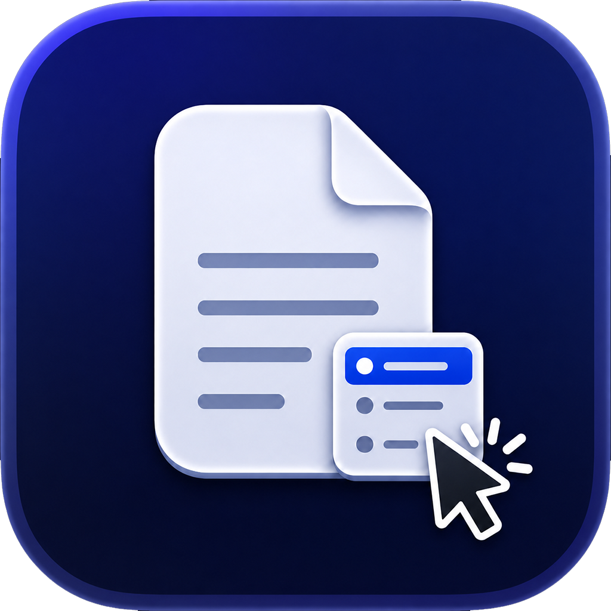
  <h1>QuickDoc</h1>
  <p>Finder の右クリックメニューとツールバーから一般的なファイルを直接作成できます。</p>
  <p>
    <a href="https://github.com/SkyImplied/QuickDoc/releases/tag/v1.6.1"></a>
    
    
    <a href="https://github.com/SkyImplied/QuickDoc/releases/download/v1.6.1/QuickDoc-1.6.1.dmg"></a>
    <a href="https://github.com/SkyImplied/QuickDoc/releases"></a>
  </p>
  <p>
    <a href="README.md">English</a> | <a href="README.zh-CN.md">简体中文</a> | <a href="README.zh-TW.md">繁體中文</a> | 日本語
  </p>
</div>

QuickDoc は macOS の Finder Sync 拡張機能を活用したユーティリティです。Finder のコンテキストメニューに実用的な「新建文件」サブメニューを追加します。v1.3 以降では Finder のツールバーにも QuickDoc を追加でき、ツールバーから直接ファイルを作成できます。

## v1.6.1 の新機能

- `Open in Terminal` の使用時に、まれに QuickDoc 本体ウィンドウが開き Dock アイコンが表示される問題を修正しました。
- 一部のユーザー環境でアプリのロゴサイズが異常に表示される問題を修正しました。

## v1.6.0 の新機能

- クラウドドライブおよび外付けドライブの Finder で、ツールバーから QuickDoc を呼び出したときにコピーとカットが動作しない問題を修正しました。
- 外付けドライブの Finder で右クリックメニューから QuickDoc を呼び出せるようになりました。旧バージョンではツールバー経由のみ対応していました。クラウドドライブは Apple の制限により、現時点では右クリックからの直接呼び出しには対応していません。引き続きツールバーをご利用ください。
- DMG インストール画面を改善しました。

### 外付けドライブの Finder 右クリックメニュー

<p align="center">
  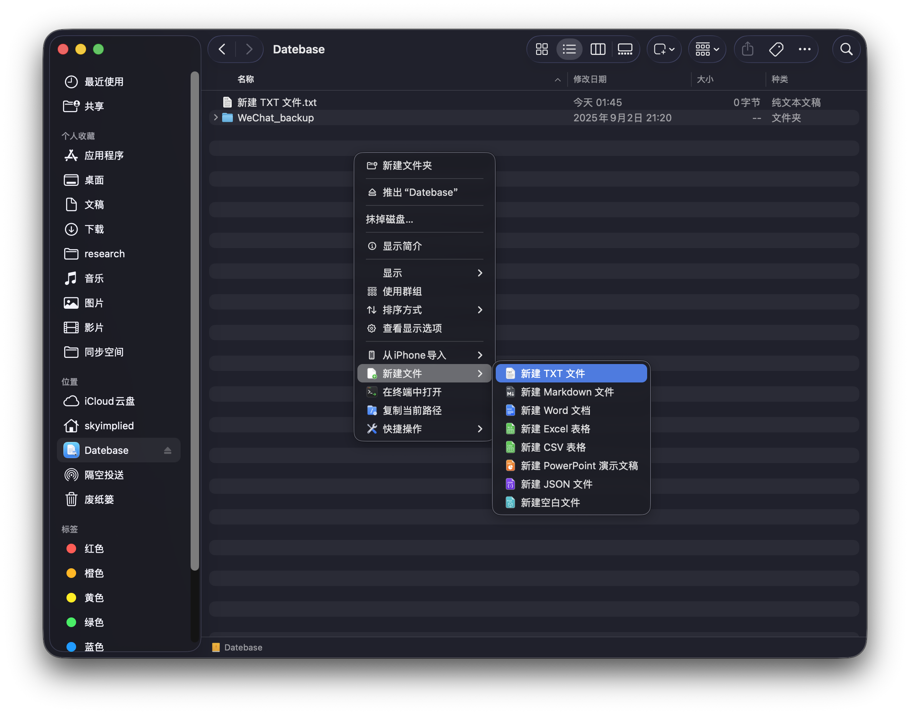
</p>

### 改善された DMG インストーラ

<p align="center">
  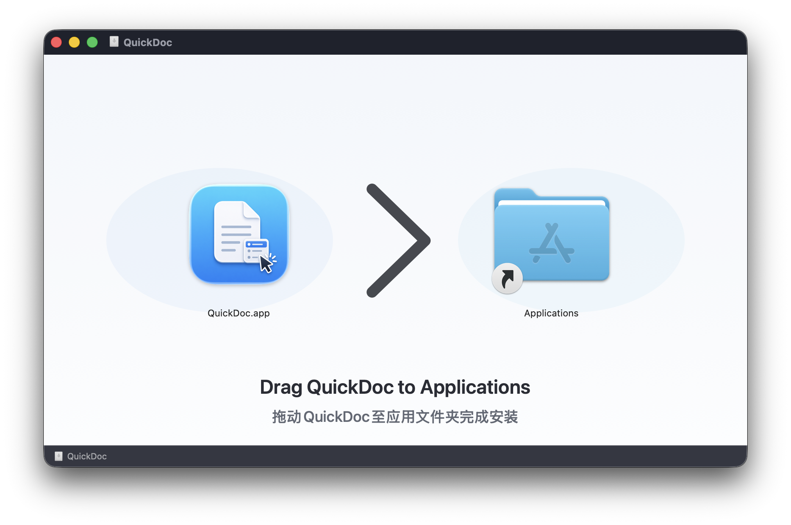
</p>

## v1.5.5 の新機能

- `复制当前路径` は Finder の現在の選択状態に追従するようになりました。何も選択していない場合は現在のフォルダのパスを、ファイルまたはフォルダを選択している場合は選択項目のフルパスをコピーします。
- 一般設定でターミナル起動とパスコピーを別々のセクションに分離し、ターミナル選択とパスコピーの挙動を確認しやすくしました。
- パスコピーの説明を見直し、有効化する前にフォルダパスと選択項目パスの違いが分かるようにしました。

## v1.5.4 の新機能

- 有効になっているファイル形式に対して、ユーザー独自のファイルテンプレートを追加できるようになりました。
- テンプレート管理画面を追加し、ファイル形式ごとに表示名、表示/非表示、並び順、名前変更、削除を管理できます。
- Finder の `新建文件` メニューは、表示対象のテンプレートがあるファイル形式では第 3 階層のテンプレートメニューを表示し、先頭に空白の既定ドキュメントを残します。
- カスタムファイル形式は `icons/空白.png` を共通アイコンとして使用し、テンプレート管理画面には有効なファイル形式だけを表示します。

### カスタムファイルテンプレート

自分のテンプレート文書をアップロードし、Finder メニューで表示する名前と表示状態を設定できます。

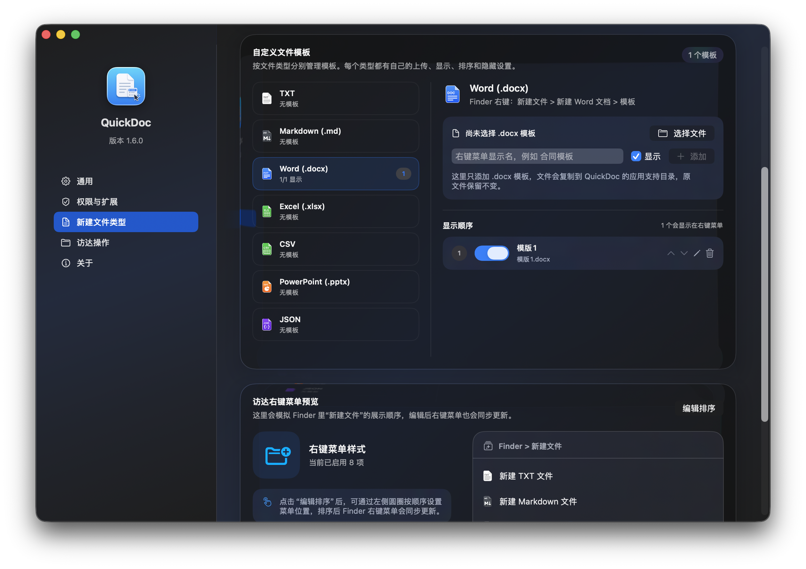

テンプレートが表示対象になっている場合、Finder では対応するファイル形式の下に第 3 階層メニューとして表示されます。

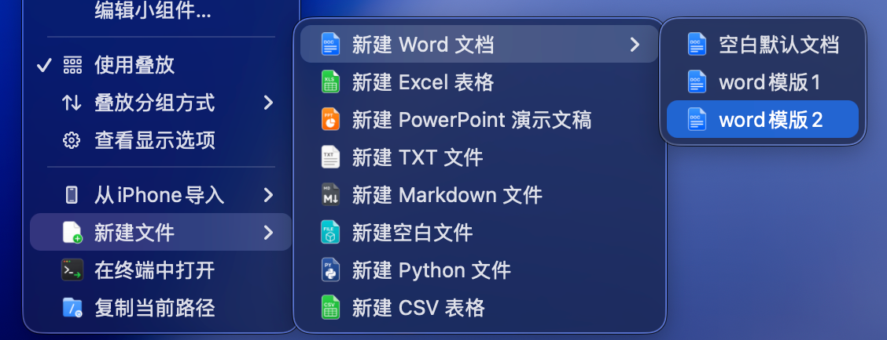

## v1.5.2 の新機能

- いくつかの既知の不具合を修正
- アプリの使い勝手を改善し、「About」ページの機能概要と連絡先情報を更新
- DMG インストール手順を改善し、より分かりやすいドラッグ案内、大きなアイコン、中央揃えのレイアウト、Retina でも鮮明なインストール文言に更新

## v1.5.1 の新機能

- Finder の右クリックで新規作成した PowerPoint（`.pptx`）を開くと、PowerPoint が内容の問題を報告して修復を求める場合がある問題を修正
- 組み込みの空白 PPTX テンプレートを更新し、PowerPoint が必要とするマスター、レイアウト、テーマ、ドキュメントプロパティ、リレーション構造を含めました

## v1.5.0 の新機能

- 「在终端中打开」でサードパーティ製ターミナルアプリを選択できるようになりました
- 一般設定に選択中のターミナルアプリのアイコン、名前、パスを表示し、変更やシステム Terminal への復元を直接行えます
- 組み込みファイル形式アイコンのスタイルを統一し、全体の見た目を整えました

## v1.4.1 の新機能

- 一般設定の「ログイン時に起動」の下に「サイレント起動」オプションを追加
- 有効にすると、macOS ログイン時にメインウィンドウを表示せずバックグラウンドで起動

## v1.4.0 の新機能

- macOS のライトモードとダークモードに自動対応する専用テンプレートアイコンをメニューバーに追加
- メニューバーアイコンは左クリックと右クリックのどちらでもショートカットメニューを表示
- メインウィンドウを開かずにファイル形式やオプションの Finder アクションを設定できるメニューバーショートカットを追加
- サブメニュー内の切り替え操作後もメニューが閉じないため、複数の設定を続けて変更可能
- 新しいバージョンのダウンロード前に確認を求め、ZIP パッケージを検証し、終了後に旧バージョンを置き換えて再起動するアプリ内アップデート機能を追加

### メニューバーショートカット

Finder の新規ファイル形式とオプションのクイックアクションをメニューバーから直接設定できます。

<p align="center">
  
</p>

### アップデートの確認

新しいバージョンが見つかると、QuickDoc はダウンロードとインストールの前に確認を求めます。

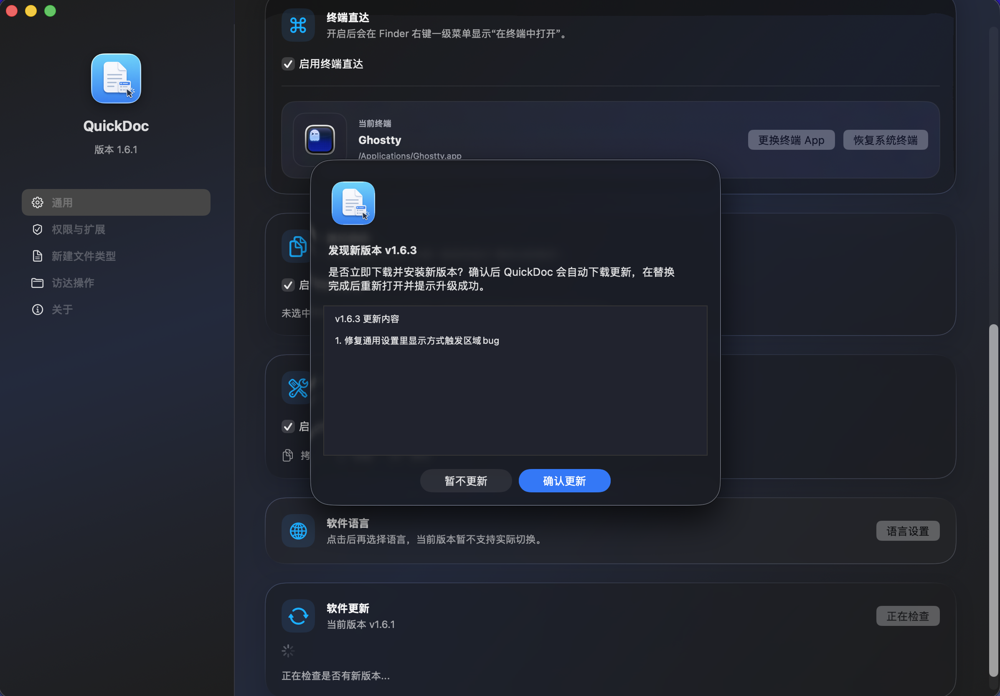

### アップデート完了

置き換えが完了すると QuickDoc は自動的に再起動し、アップグレード完了を通知します。


## v1.3.1 の新機能

- デスクトップにファイルを作成すると不要な Finder ウィンドウが開く場合がある問題を修正
- 「在终端中打开」でホームディレクトリのターミナルウィンドウが余分に開く場合がある問題を修正
- [#4](https://github.com/SkyImplied/QuickDoc/pull/4) で修正に貢献してくださった [DD-hit](https://github.com/DD-hit) さんに感謝します

## v1.3 の新機能

- Finder のツールバーに QuickDoc を追加して直接起動できるエントリを追加
- ローカルフォルダ、外付けドライブ、クラウドドライブなど、監視対象の Finder フォルダでツールバー機能を利用可能
- ユーザーフォルダ、一般的なディレクトリ、外部ボリューム、iCloud Drive まで監視範囲を拡張し、外付けドライブとクラウドドライブでの問題を修正
- 「一般」「権限と拡張機能」「新規ファイル形式」「Finder アクション」のページを備えた設定アプリを追加
- メニューバーのみ、メニューバーと Dock の両方を非表示、Dock のみ、メニューバーと Dock の両方を表示、という 4 種類の表示モードを追加
- ログイン時に起動、ターミナルで開く、現在のパスをコピーするための切り替え設定を追加
- Finder Sync 拡張機能の状態確認と、システム設定へのショートカットを追加
- Finder の右クリックメニューと同期するプレビューと並べ替え機能を追加
- 設定変更後に拡張機能をより確実に再読み込みできるよう Finder の再起動処理を改善

## QuickDoc を使う理由

- 別のアプリを開かずに Finder から一般的なファイルを直接作成
- 独自テンプレートからファイルを作成し、よく使う文書スタイルを毎回作り直す手間を減らせます
- 実際に使うファイル形式だけを表示
- 独自のワークフローに合わせてカスタム拡張子を追加
- 視覚的なプレビューでコンテキストメニューを整理
- 同じ右クリックメニューから現在のフォルダをターミナルで開く、またはパスをコピー
- 同名ファイルがある場合は番号付きの接尾辞を自動追加して上書きを防止

## 対応ファイル形式

v1.6.1 に組み込まれているファイル形式：

- TXT
- Markdown（`.md`）
- Word（`.docx`）
- Excel（`.xlsx`）
- CSV
- PowerPoint（`.pptx`）
- JSON
- 空のファイル
- Python（`.py`）
- HTML
- Shell（`.sh`）
- Rich Text（`.rtf`）

初期状態で有効な形式は `TXT`、`Markdown`、`Word`、`Excel`、`CSV`、`PowerPoint`、`JSON`、`空のファイル` です。

## スクリーンショット

### 一般設定

一般設定ページでは、起動動作、表示モード、「在终端中打开」「复制当前路径」などの右クリックアクション、アプリ内アップデートを管理できます。

<p align="center">
  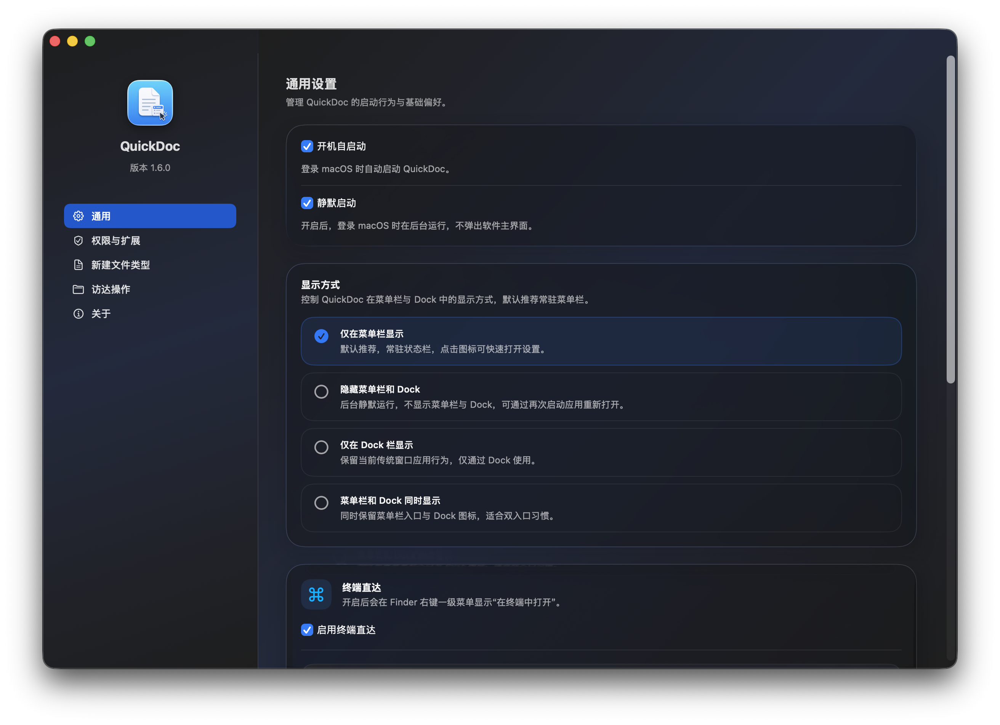
  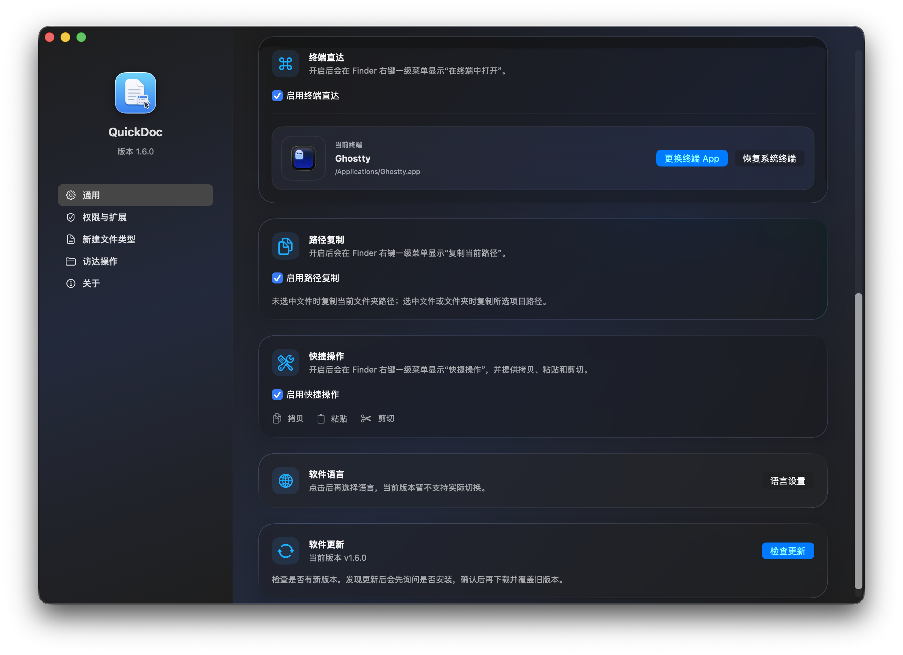
</p>

### Finder のコンテキストメニュー

拡張機能を有効にすると、Finder に「新建文件」が表示され、必要に応じてクイックアクションも利用できます。

<p align="center">
  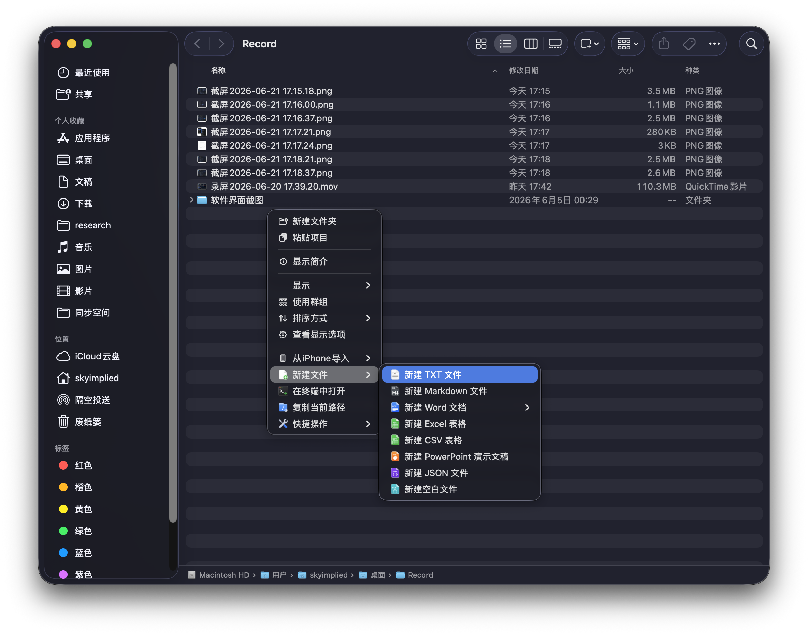
</p>

### 権限と拡張機能

QuickDoc は Finder Sync 拡張機能が有効かどうかを確認し、適切な macOS 設定ページを案内します。


### 新規ファイル形式とテンプレート

組み込みのファイル形式を有効または無効にし、カスタム拡張子とテンプレートを管理して、プレビュー領域からメニューの順序を編集できます。

<p align="center">
  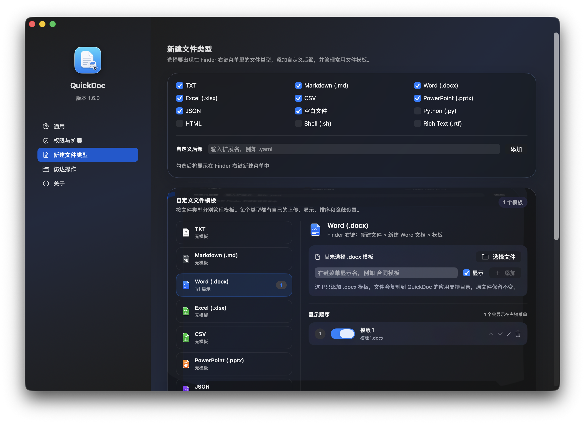
  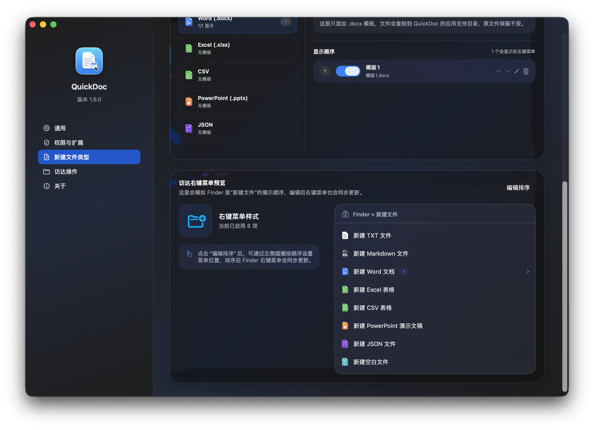
</p>

### メニューバーショートカット

Finder の新規ファイル形式と任意のクイックアクションをメニューバーから直接設定できます。

<p align="center">
  
</p>

### カスタムファイルテンプレート

ファイル形式ごとにテンプレートを管理し、Finder に表示するテンプレートとテンプレートサブメニューを調整できます。

<p align="center">
  
  
</p>

### Finder アクション

Finder のメニューがすぐに更新されない場合は、QuickDoc から Finder を再起動して拡張機能を再読み込みできます。


### About

About ページには、アプリの概要、バージョン、連絡先への入口がまとまっています。

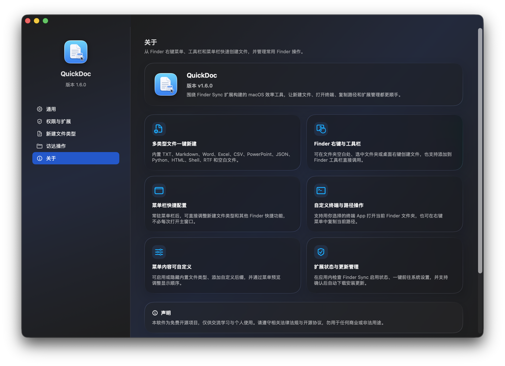

## 使用方法

1. `QuickDoc.app` を起動
2. 「权限与扩展」ページを開くか、`打开扩展设置` をクリック
3. macOS の Finder Extensions で `QuickDocFinderSync` を有効化
4. Finder のフォルダ背景、選択したフォルダ、またはデスクトップを右クリック
5. `新建文件` を選択し、必要なファイルを作成

設定で有効にすると、Finder のトップレベルのコンテキストメニューに `在终端中打开` と `复制当前路径` も表示されます。

## インストール

最も簡単な方法は GitHub Releases から最新の `QuickDoc-<version>.dmg` をダウンロードし、開いた後に `QuickDoc.app` を `Applications` にドラッグすることです。

続いて：

1. `QuickDoc.app` を開く
2. `权限与扩展` ページに移動するか、`打开扩展设置` をクリック
3. `システム設定 > プライバシーとセキュリティ > ログイン項目と機能拡張` で `QuickDocFinderSync` を有効化
4. メニューがすぐに表示されない場合は QuickDoc の `立即重启 Finder` を使用

v1.4.0 をインストールすると、以降のバージョンは一般設定ページ下部の `检查更新` から確認できます。新しいバージョンが見つかると QuickDoc はインストール前に確認を求め、同意後にダウンロードと置き換えを行います。完了すると自動的に再起動し、アップグレード完了を通知します。

macOS で開発元を確認できないという警告が表示された場合は、Finder で `Control` キーを押しながらアプリをクリックし、`開く` を選択してください。

## ソースからビルド

Finder Sync 拡張機能は Command Line Tools だけではビルドできないため、QuickDoc には完全版の Xcode が必要です。

### 方法 1：1 つのコマンドでローカルビルドして実行

```bash
sudo xcode-select -s /Applications/Xcode.app/Contents/Developer
./script/build_and_run.sh
```

このスクリプトは次の処理を行います：

1. `QuickDoc` アプリと Finder 拡張機能をビルド
2. Finder 拡張機能の登録を更新
3. Finder を再起動
4. `QuickDoc.app` を起動

初回起動後、macOS が拡張機能をまだ自動的に有効化していない場合は、`QuickDocFinderSync` を手動で有効にしてください。

### 方法 2：Xcode で手動ビルド

1. 必要に応じて一度実行：

```bash
sudo xcode-select -s /Applications/Xcode.app/Contents/Developer
```

2. Xcode で `QuickDoc.xcodeproj` を開く
3. `QuickDoc` スキームを選択
4. `Run` をクリック
5. Finder Extensions で `QuickDocFinderSync` を有効化

## リリース成果物をビルド

ソースから `.app`、`.zip`、`.dmg` をパッケージ化するには：

```bash
./script/package_release.sh
```

成果物は `build/release/` に生成されます。

## トラブルシューティング

設定変更や再ビルド後に Finder メニューが更新されない場合は、Finder を再起動してください：

```bash
killall Finder
```

メニューをクリックしても反応しない場合は、操作中にアプリと拡張機能のログを確認してください：

```bash
log stream --info --style compact --predicate 'process == "QuickDoc" OR process == "QuickDocFinderSync"'
```
