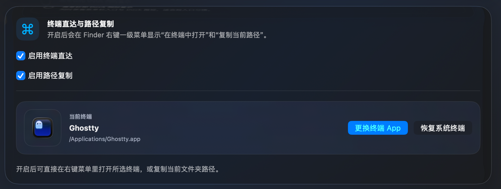

<div align="center">
  
  <h1>QuickDoc</h1>
  <p>Create common files directly from Finder's right-click menu and toolbar.</p>
  <p>
    <a href="https://github.com/SkyImplied/QuickDoc/releases/tag/v1.5.1"></a>
    
    
    <a href="https://github.com/SkyImplied/QuickDoc/releases/download/v1.5.1/QuickDoc-1.5.1.dmg"></a>
    <a href="https://github.com/SkyImplied/QuickDoc/releases"></a>
    <a href="https://github.com/SkyImplied/QuickDoc/stargazers"></a>
  </p>
  <p>
    English | <a href="README.zh-CN.md">简体中文</a> | <a href="README.zh-TW.md">繁體中文</a> | <a href="README.ja.md">日本語</a>
  </p>
</div>

QuickDoc is a macOS utility built around a Finder Sync extension. It adds a practical `New File` submenu to Finder's context menu, and since v1.3 it also supports adding QuickDoc to the Finder toolbar so file creation can be invoked directly from the toolbar.

## What's New in v1.5.1

- Fixed an issue where PowerPoint could report newly created `.pptx` files as having problematic content and ask to repair them
- Updated the built-in blank PPTX template with the standard masters, layouts, theme, document properties, and relationships expected by PowerPoint

## What's New in v1.5.0

- Added custom terminal app support for `Open in Terminal`, so users can choose third-party terminals instead of being limited to macOS Terminal
- The General settings page now shows the selected terminal app with its icon, name, and path, plus direct actions to change it or restore the system Terminal
- Refactored the built-in file type icons with a more unified visual style

### Custom terminal app

Choose your preferred terminal app from General settings. QuickDoc will use that app when opening the current Finder folder from the right-click menu.



## What's New in v1.4.1

- Added a `Silent Launch` option beneath `Launch at Login` in General settings
- When enabled, QuickDoc starts in the background after macOS login without opening the main window

## What's New in v1.4.0

- Added a dedicated template menu bar icon with automatic light and dark mode adaptation
- Both left-click and right-click now open the menu bar shortcut menu
- Added menu bar shortcuts for configuring new file types and optional Finder actions without opening the main window
- Secondary menu toggles stay open so multiple settings can be changed in one pass
- Added an in-app update checker that asks for confirmation before downloading a new version, validates the ZIP package, replaces the previous app after quitting, relaunches QuickDoc, and confirms when the upgrade is complete

### Menu bar shortcuts

Configure Finder new-file types and optional quick actions directly from the menu bar.

<p align="center">
  
</p>

### Update confirmation

When a newer version is available, QuickDoc asks for confirmation before downloading and installing it.


### Update complete

After replacement succeeds, QuickDoc relaunches automatically and confirms that the upgrade is complete.


## What's New in v1.3.1

- Fixed an issue where creating a file on the Desktop could open an unwanted Finder window
- Fixed an issue where `Open in Terminal` could launch an extra terminal window in the home directory
- Thanks to [DD-hit](https://github.com/DD-hit) for contributing these fixes in [#4](https://github.com/SkyImplied/QuickDoc/pull/4)

## What's New in v1.3

- Added a Finder toolbar entry so QuickDoc can be added to Finder's toolbar and invoked directly
- Finder toolbar support works across local Finder folders, external drives, cloud drive folders, and other monitored locations
- Expanded Finder Sync monitoring to user folders, common directories, external volumes, and iCloud Drive, fixing previous external-drive and cloud-drive coverage gaps
- Added a redesigned settings app with pages for `General`, `Permissions & Extensions`, `New File Types`, and `Finder Actions`
- Added four app display modes: menu bar only, hidden in both menu bar and Dock, Dock only, and menu bar + Dock
- Added launch at login, `Open in Terminal`, and `Copy Current Path` toggles
- Added in-app Finder Sync status confirmation with a direct shortcut to system settings
- Added menu preview and ordering controls so the Finder right-click menu stays in sync with your chosen order
- Improved Finder restart flow so extension refresh is more reliable after configuration changes

## Why QuickDoc

- Create common files directly from Finder without opening another app
- Show only the file types you actually use
- Add custom extensions for your own workflow
- Keep the context menu organized with visual ordering controls
- Open the current folder in your selected terminal app or copy its path from the same right-click menu
- Avoid overwriting files by automatically appending numeric suffixes when names already exist

## Supported File Types

Built-in file types in v1.5.1:

- TXT
- Markdown (`.md`)
- Word (`.docx`)
- Excel (`.xlsx`)
- CSV
- PowerPoint (`.pptx`)
- JSON
- Blank file
- Python (`.py`)
- HTML
- Shell (`.sh`)
- Rich Text (`.rtf`)

Default-enabled types are `TXT`, `Markdown`, `Word`, `Excel`, `CSV`, `PowerPoint`, `JSON`, and `Blank file`.

## Screenshots

### General settings

The general page manages launch behavior, display mode, right-click quick actions such as `Open in Terminal` and `Copy Current Path`, custom terminal app selection, and in-app update checks.


### Finder context menu

After the extension is enabled, `New File` appears in Finder together with optional quick actions.

<p align="center">
  
</p>

### Permissions and extensions

QuickDoc can verify whether the Finder Sync extension is enabled and guide you to the correct macOS settings page.


### New file types and menu preview

Enable or disable built-in file types, add custom extensions, and edit the menu order from the preview area.


### Finder actions

If Finder does not refresh immediately, QuickDoc provides a one-click restart action to reload the extension.


## How It Works

1. Launch `QuickDoc.app`
2. Open the `Permissions & Extensions` page or use `Open Extension Settings`
3. Enable `QuickDocFinderSync` in macOS Finder Extensions
4. Right-click a folder background, selected folder, or the Desktop in Finder
5. Choose `新建文件` and create the file you want

If enabled in settings, `在终端中打开` and `复制当前路径` will also appear in the top-level Finder context menu.

`在终端中打开` uses the terminal app selected in General settings. You can choose a third-party terminal app or restore the system Terminal at any time.

## Installation

The simplest way is to download the latest `QuickDoc-<version>.dmg` from GitHub Releases, open it, and drag `QuickDoc.app` into `Applications`.

Then:

1. Open `QuickDoc.app`
2. Go to `权限与扩展` or click `打开扩展设置`
3. Enable `QuickDocFinderSync` in `System Settings > Privacy & Security > Login Items & Extensions`
4. If the menu does not appear right away, use QuickDoc's `立即重启 Finder` action

After installing v1.4.0 or later, future versions can be checked from the `检查更新` button at the bottom of the General page. QuickDoc asks for confirmation before downloading an available update, then relaunches automatically and confirms when the upgrade is complete.

If macOS warns that the app is from an unidentified developer, open it once from Finder with `Control` + click and choose `Open`.

## Build From Source

QuickDoc requires full Xcode because Finder Sync extensions cannot be built with Command Line Tools alone.

### Option 1: build and run locally with one command

```bash
sudo xcode-select -s /Applications/Xcode.app/Contents/Developer
./script/build_and_run.sh
```

This script will:

1. Build the `QuickDoc` app and Finder extension
2. Refresh Finder extension registration
3. Restart Finder
4. Launch `QuickDoc.app`

After the first launch, enable `QuickDocFinderSync` manually if macOS has not enabled it yet.

### Option 2: build manually in Xcode

1. Run this once if needed:

```bash
sudo xcode-select -s /Applications/Xcode.app/Contents/Developer
```

2. Open `QuickDoc.xcodeproj` in Xcode
3. Select the `QuickDoc` scheme
4. Click `Run`
5. Enable `QuickDocFinderSync` in Finder Extensions

## Build Release Artifacts

To package your own `.app`, `.zip`, or `.dmg` from source:

```bash
./script/package_release.sh
```

Artifacts will be generated in `dist/`.

## Troubleshooting

If Finder does not refresh after changing settings or rebuilding, restart Finder:

```bash
killall Finder
```

If a menu click does nothing, stream app and extension logs while testing:

```bash
log stream --info --style compact --predicate 'process == "QuickDoc" OR process == "QuickDocFinderSync"'
```
