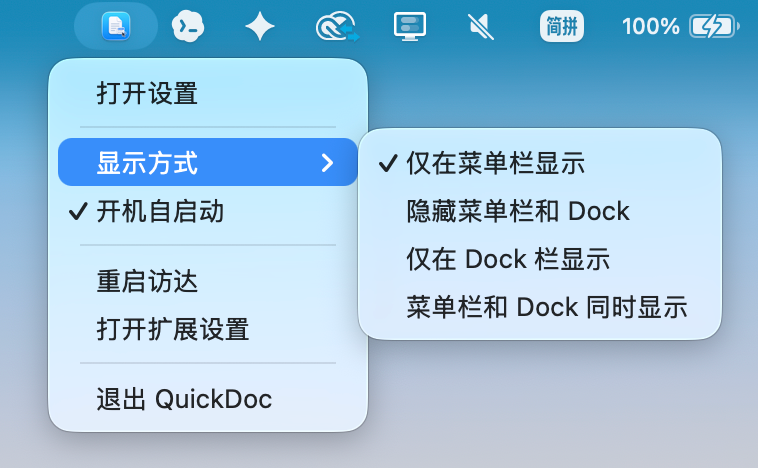
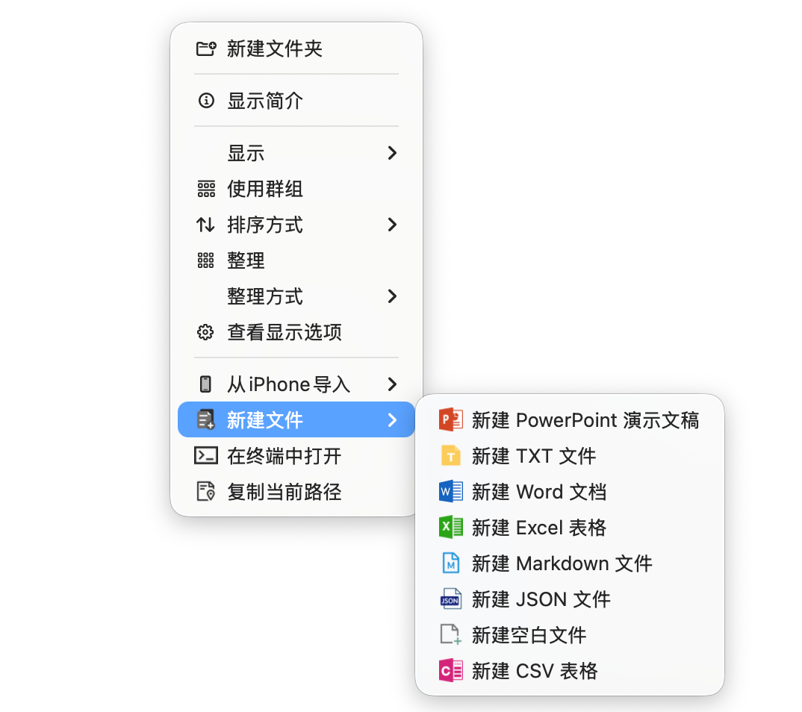
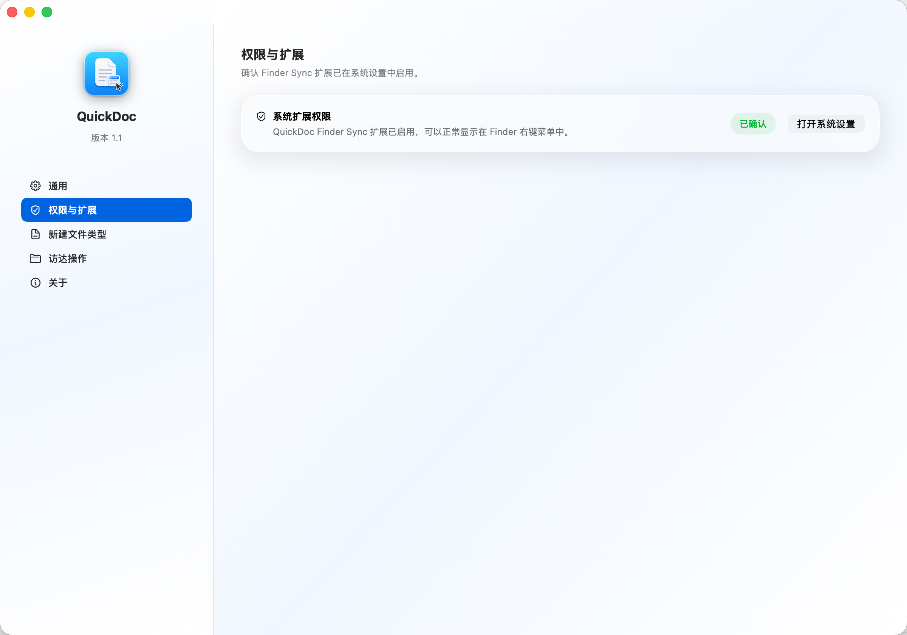
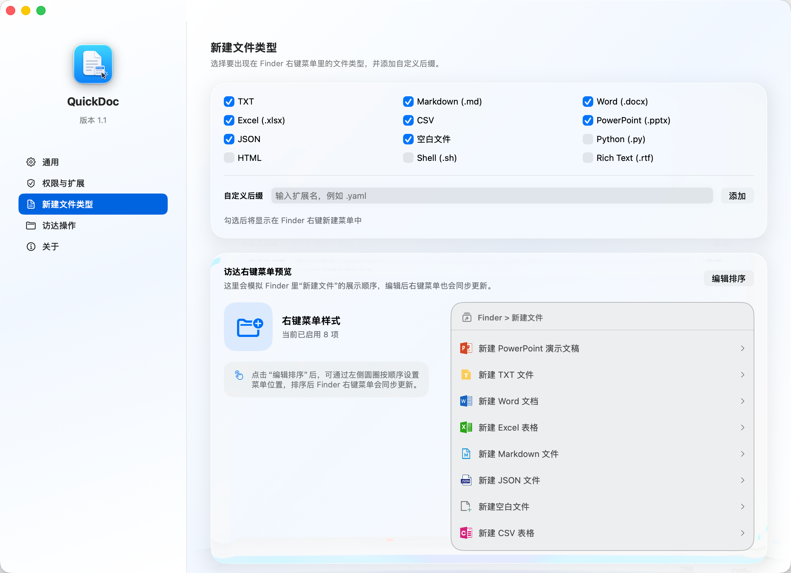
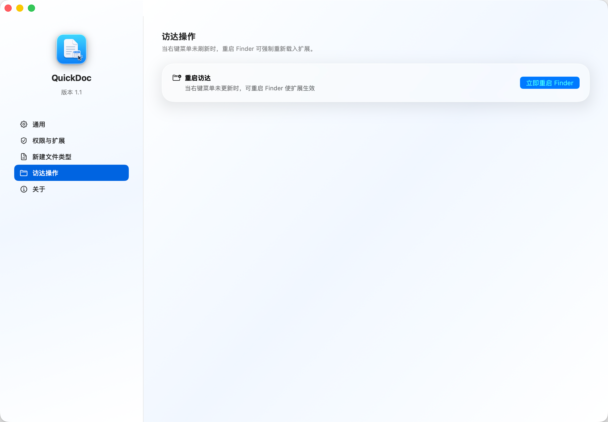

# QuickDoc

[中文说明](README.zh-CN.md)

QuickDoc is a macOS utility built around a Finder Sync extension. It adds a practical `New File` submenu to Finder's context menu, and in v1.1 it also brings a dedicated settings app for menu visibility, extension status checks, menu ordering, and quick Finder actions.

## What's New in v1.1

- Added a redesigned settings app with pages for `General`, `Permissions & Extensions`, `New File Types`, and `Finder Actions`
- Added four app display modes: menu bar only, hidden in both menu bar and Dock, Dock only, and menu bar + Dock
- Added launch at login, `Open in Terminal`, and `Copy Current Path` toggles
- Added in-app Finder Sync status confirmation with a direct shortcut to system settings
- Added menu preview and ordering controls so the Finder right-click menu stays in sync with your chosen order
- Improved Finder restart flow so extension refresh is more reliable after configuration changes

## Why QuickDoc

- Create common files directly from Finder without opening another app
- Show only the file types you actually use
- Add custom extensions for your own workflow
- Keep the context menu organized with visual ordering controls
- Open the current folder in Terminal or copy its path from the same right-click menu
- Avoid overwriting files by automatically appending numeric suffixes when names already exist

## Supported File Types

Built-in file types in v1.1:

- TXT
- Markdown (`.md`)
- Word (`.docx`)
- Excel (`.xlsx`)
- CSV
- PowerPoint (`.pptx`)
- JSON
- Blank file
- Python (`.py`)
- HTML
- Shell (`.sh`)
- Rich Text (`.rtf`)

Default-enabled types are `TXT`, `Markdown`, `Word`, `Excel`, `CSV`, `PowerPoint`, `JSON`, and `Blank file`.

## Screenshots

### Menu bar controls

Use the status bar icon to open settings, switch display mode, toggle launch at login, restart Finder, or jump to extension settings.



### General settings

The general page manages launch behavior, display mode, and right-click quick actions such as `Open in Terminal` and `Copy Current Path`.


### Finder context menu

After the extension is enabled, `New File` appears in Finder together with optional quick actions.



### Permissions and extensions

QuickDoc can verify whether the Finder Sync extension is enabled and guide you to the correct macOS settings page.



### New file types and menu preview

Enable or disable built-in file types, add custom extensions, and edit the menu order from the preview area.



### Finder actions

If Finder does not refresh immediately, QuickDoc provides a one-click restart action to reload the extension.



## How It Works

1. Launch `QuickDoc.app`
2. Open the `Permissions & Extensions` page or use `Open Extension Settings`
3. Enable `QuickDocFinderSync` in macOS Finder Extensions
4. Right-click a folder background, selected folder, or the Desktop in Finder
5. Choose `新建文件` and create the file you want

If enabled in settings, `在终端中打开` and `复制当前路径` will also appear in the top-level Finder context menu.

## Installation

The simplest way is to download the latest `QuickDoc-<version>.dmg` from GitHub Releases, open it, and drag `QuickDoc.app` into `Applications`.

Then:

1. Open `QuickDoc.app`
2. Go to `权限与扩展` or click `打开扩展设置`
3. Enable `QuickDocFinderSync` in `System Settings > Privacy & Security > Login Items & Extensions`
4. If the menu does not appear right away, use QuickDoc's `立即重启 Finder` action

If macOS warns that the app is from an unidentified developer, open it once from Finder with `Control` + click and choose `Open`.

## Build From Source

QuickDoc requires full Xcode because Finder Sync extensions cannot be built with Command Line Tools alone.

### Option 1: build and run locally with one command

```bash
sudo xcode-select -s /Applications/Xcode.app/Contents/Developer
./script/build_and_run.sh
```

This script will:

1. Build the `QuickDoc` app and Finder extension
2. Refresh Finder extension registration
3. Restart Finder
4. Launch `QuickDoc.app`

After the first launch, enable `QuickDocFinderSync` manually if macOS has not enabled it yet.

### Option 2: build manually in Xcode

1. Run this once if needed:

```bash
sudo xcode-select -s /Applications/Xcode.app/Contents/Developer
```

2. Open `QuickDoc.xcodeproj` in Xcode
3. Select the `QuickDoc` scheme
4. Click `Run`
5. Enable `QuickDocFinderSync` in Finder Extensions

## Build Release Artifacts

To package your own `.app`, `.zip`, or `.dmg` from source:

```bash
./script/package_release.sh
```

Artifacts will be generated in `dist/`.

## Troubleshooting

If Finder does not refresh after changing settings or rebuilding, restart Finder:

```bash
killall Finder
```

If a menu click does nothing, stream app and extension logs while testing:

```bash
log stream --info --style compact --predicate 'process == "QuickDoc" OR process == "QuickDocFinderSync"'
```
