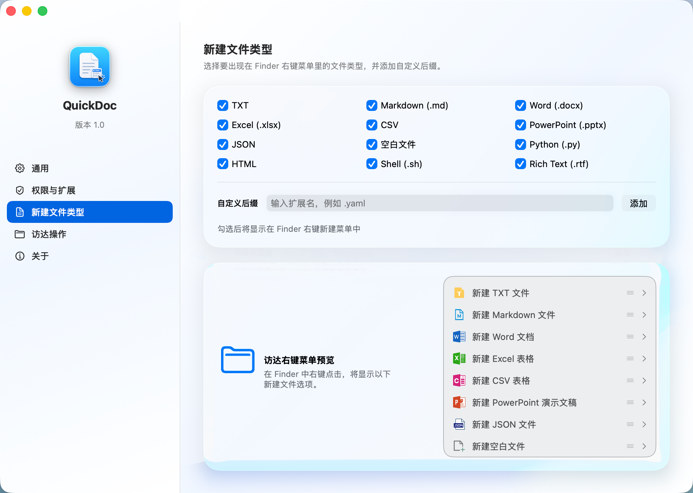
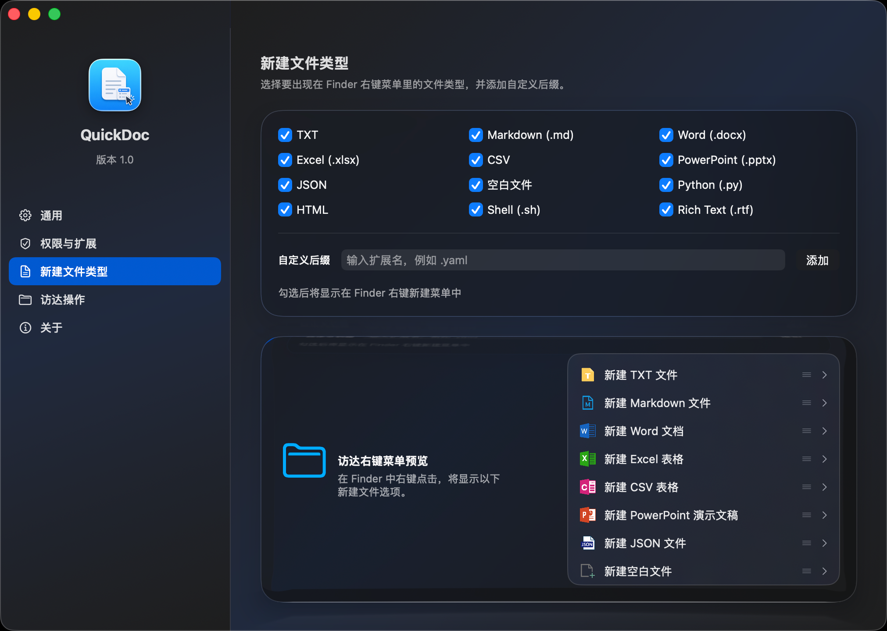
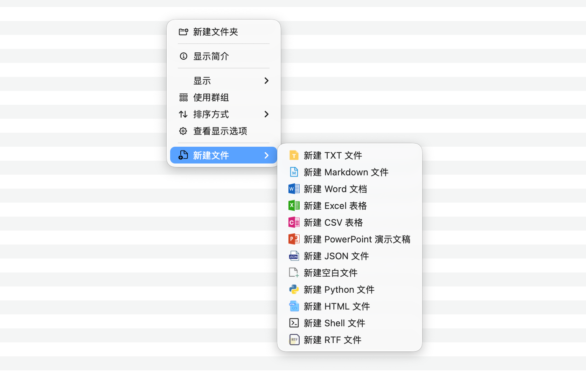

# QuickDoc

[English README](README.md)

QuickDoc 是一个 macOS Finder Sync 扩展，可以把“新建文件”菜单直接加到 Finder 右键菜单中，让你在文件夹背景、选中文件夹或桌面上快速创建常见文件。

## 效果预览

### 浅色模式应用界面



### 深色模式应用界面



### Finder 右键菜单



## 功能亮点

- 直接在 Finder 右键菜单中新建常见文件
- 内置支持 TXT、Markdown、Word、Excel、PowerPoint、CSV、JSON、空白文件、Python、HTML、Shell、RTF
- 可在应用内控制哪些文件类型显示在菜单中
- 支持添加自定义后缀，适配个人工作流
- 同时适配浅色模式和深色模式
- 自动避免重名，已存在文件时会追加数字后缀

## 使用方式

1. 启动 `QuickDoc.app`
2. 在系统中启用 `QuickDocFinderSync`
3. 在 Finder 中右键并选择 `新建文件`
4. 选择要创建的文件类型

## 安装方式

推荐直接从 GitHub Releases 下载最新的 `QuickDoc-<version>.dmg`，打开后把 `QuickDoc.app` 拖到 `Applications`。

然后：

1. 打开 `QuickDoc.app`
2. 点击 `打开扩展设置`
3. 在 Finder Extensions 中启用 `QuickDocFinderSync`
4. 如果右键菜单没有立即出现，重启 Finder

如果 macOS 提示应用来自未识别的开发者，可在 Finder 中按住 `Control` 点击应用，再选择 `打开`。

## 从源码编译

QuickDoc 依赖完整 Xcode，因为 Finder Sync 扩展不能只靠 Command Line Tools 构建。

### 方式一：一键本地构建并运行

```bash
sudo xcode-select -s /Applications/Xcode.app/Contents/Developer
./script/build_and_run.sh
```

这个脚本会自动：

1. 构建 `QuickDoc` 主程序和 Finder 扩展
2. 刷新 Finder 扩展注册
3. 重启 Finder
4. 启动 `QuickDoc.app`

首次运行后，如果系统还没有自动启用扩展，请手动在 Finder Extensions 中启用 `QuickDocFinderSync`。

### 方式二：使用 Xcode 手动编译

1. 先执行一次：

```bash
sudo xcode-select -s /Applications/Xcode.app/Contents/Developer
```

2. 使用 Xcode 打开 `QuickDoc.xcodeproj`
3. 选择 `QuickDoc` scheme
4. 点击 Run
5. 在 Finder Extensions 中启用 `QuickDocFinderSync`

## 从源码生成分发文件

如果你想自己从源码生成 `.app`、`.zip` 或 `.dmg`：

```bash
./script/package_release.sh
```

生成产物会输出到 `dist/` 目录。

## 故障排查

如果修改代码后 Finder 菜单没有刷新，可以重启 Finder：

```bash
killall Finder
```

如果点击菜单没有反应，可以边操作边查看扩展日志：

```bash
log stream --info --style compact --predicate 'process == "QuickDoc" OR process == "QuickDocFinderSync"'
```
